# **Build a Traffic Sign Recognition with Keras/Tensorflow**
#

**Build a Traffic Sign Recognition Project**

The goals of this project are the following:
* Load the data set
* Explore, summarize and visualize the data set
* Design, train and test with different model architectures (LeNet, GoogLeNet, ResNet34)
* Use the model to make predictions on new images
* Analyze the softmax probabilities of the new images
* Summarize the results

*Author : nguyenrobot*  
*Copyright : nguyenrobot*  
https://github.com/nguyenrobot  
https://www.nguyenrobot.com  

*Current github repos*  
https://github.com/nguyenrobot/Traffic-Sign-Recognition-with-Keras-Tensorflow  

*Medium article*
https://nguyenrobot.medium.com/build-a-traffic-sign-recognition-with-keras-tensorflow-7c01f093f3df  

*Jupyter notebooks*  
traffic_sign_classifier_LeNet.ipynb  
traffic_sign_classifier_GoogLeNet.ipynb  
traffic_sign_classifier_ResNet.ipynb  

`Keras` : in Tensorlfow 2, Keras is the official high-level API that helps beginners start more quickly and concentrate on model architecture than dealing with low-level APIs

In the end, we will also try to classify some traffic signs taken on french roads :  
*Traffic signs to classsify &#8595;*  
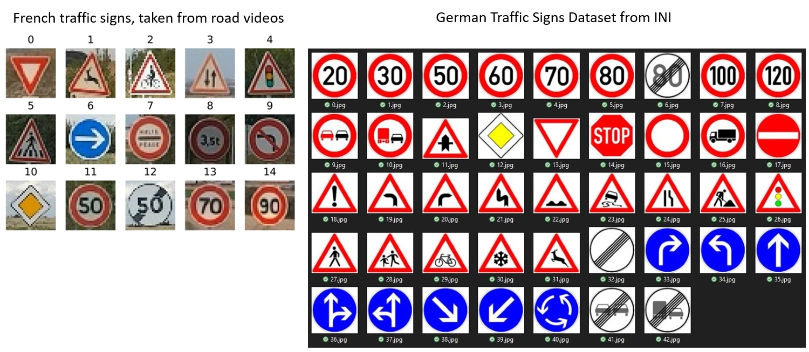

Overview
---
In this project, we will implement deep neural networks to classify traffic signs. We train and validate models so they can classify traffic sign images using the [German Traffic Sign Dataset](http://benchmark.ini.rub.de/?section=gtsrb&subsection=dataset).

We will re-build some famous deep neural networks in this tutorial :   
* LeNet by Yann Lecun in 1998
* GoogLeNet by Google team, the winner of ILSVRS 2014 challenged
* ResNet34, a lite version of Resnet50 by Microsoft team, the winner of ILSVRS 2015 challenged  

The first idea of artificial neural networks came from Warren McCulloch - a neurophysiologist, and Walter Pitts - a logician, in 1943. But it takes many years later to see their real-time applications in our daily life.  Some important factors could be listed here with honour:  
- [x] GPU, thank gaming industry ^_^ that GPU gets more powerful and cheaper. GPU is designed to work well with matrix operations and parallel instruction that help artificial neural networks learn faster than on a CPU  
- [x] Data : when talking about artificial, we talk about data. The internet gets our world flatter and eases the data collection phase (it's both negative and positive !), also the data exchange  
- [x] Memory (Disk + RAM + Cloud) : data need to be stored. Memory gets faster, cheaper with an incredible speed that helps artificial intelligence developments progress  
- [x] Researchers and opensource community : nowadays, we can build a pre-trained state-of-the-art neural network by typing roughly 15 lines of code. It's a fruit of many years of works and researches of academic, industrial and opensource community  
- [x] LeNet  by Yann LeCun, a simple architecture but robust that inspire modern architectures as AlexNet (2012), GoogLeNet/Inception (2014), ResNet (2015).  

...
It's not easy to resume near 80 years (to 2020) of deep-learning evolution and explain very abstract notions of deep-learning in a single article when we are not experts. Thankfully, there are other helpful sources that you can learn to deep dive in Deep Learning if motivated :  
*good books to read  
[Hands-On Machine Learning with Scikit-Learn, Keras and TensorFlow by Aurélien Géron](https://www.amazon.fr/dp/B07XGF2G87)  
[Deep Learning with Python by Francois Chollet](https://www.amazon.fr/Deep-Learning-Python-Francois-Chollet/dp/8441542252)  

*good courses to follow  
[FastAI Course](https://course.fast.ai/)  
[Self-Driving Car Engineer Nanodegree Program](https://www.udacity.com/course/self-driving-car-engineer-nanodegree--nd013)  

`remark :` an image classifier takes an input image then predict if it belongs to a defined class. A classifier doesn't scan input image and find/localize objects inside. I will have another tutorial on object detection (aka. classifying and localization) in the future.  

## Key notions of supervised deep Learning
We will talk about some key notions of `supervised` deep learning which the model is trained with pre-labelled datasets.  
`remark :` I try to figure out abstract and complicated notions of deep learning by using simplified and abusive language, sometimes it's not the standard academic notion   
#### 1. Convolutional filter  
The convolutional filter is omnipresent in deep learning, it's a key element for feature extraction from an input.  
A basic convolutional filter that we may have seen many times is Sobel operator which helps us to calculate 1st degree derivative on grayscale image :

*Sobel operator in x-direction &#8595;*  
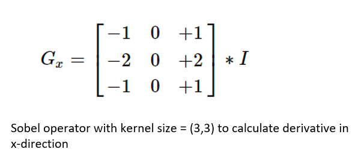

>Source : [OpenCV Documentation](https://docs.opencv.org/3.4/d2/d2c/tutorial_sobel_derivatives.html)

In deep learning, convolutional filters are randomly initialized at the beginning then gradually get updated thank to back-propagation algorithms in the training phase.  

Please check my previous tutorial for Sobel and its applications in line-detection here :
https://github.com/nguyenrobot/lane_detection_advanced_sliding_windows

#### 2. Neurons in neural networks
A neural network could be considered as a weighted multi-voting system where each neuron takes votes from previous’ layer’s neurons or from the inputs.  
<Every neuron is not equal !>, the neural network is not a democratic country. Every vote is weighted.   

Normally, neurons' outputs of the last layer is called ‘logits’. In abusive language, we could also call every neuron’s output as logit. An output of a neuron is very similar to a fuzzy logic output. So, what logit stands for ?  
_logit = 0 : white vote or blank vote, aka. ‘no comment’  
_logit > 0 : YES answer, higher the logit the neuron is more sure about its ‘YES’   conclusion  
_logit < 0 : NO answer, lower the logit the neuron is more sure about its ‘NO’ conclusion  

*Neural network &#8595;*  
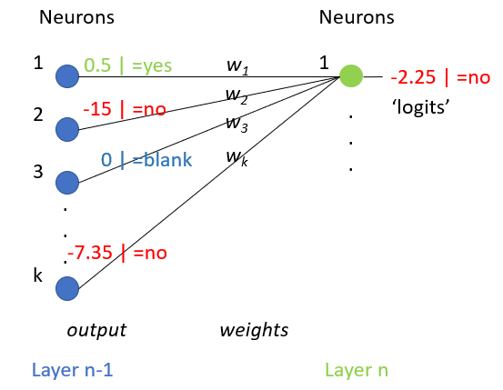

>Source : nguyenrobot

Why called deep-learning ? When a neural network has many hidden (intermediate) layer, it's called deep neural network (DNN). Usually, end-user doesn't need to see intermediate layers results, so for them, it's some kind of black-box or deep learning.  

#### 3. Softmax activation
Softmax activation function is frequently used in multi-classes classifying in the last layer.  
Without softmax activation, we get logits at the outputs of a neural network which show us the degree of similarity of the input with each pre-labelled classes.  

*Wihout softmax activation &#8595;*  
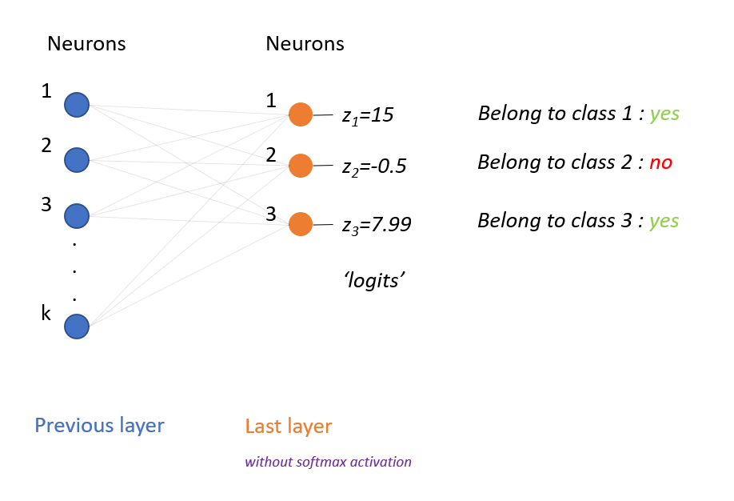

>Source : nguyenrobot

However, logits are very abstract we need to convert them to probabilities summing up to 1. So, the softmax activation is here to figure out probabilities that the input could belong to a class.  

*Softmax activation & probabilities &#8595;*  
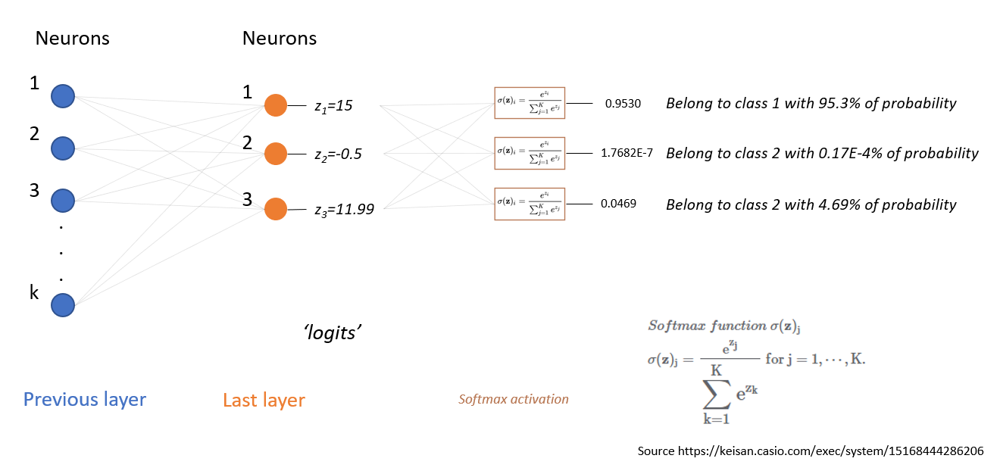

>Source : nguyenrobot

#### 4. ReLU activation function  
The ReLU activation function is widely used in deep learning. ReLU gets passed ‘YES’ answer of a neuron and neutralize other types of answer.  
The ReLu actionvation is really simple defined as : f(x)=max(0,x)  

*ReLU activation function definition &#8595;*  
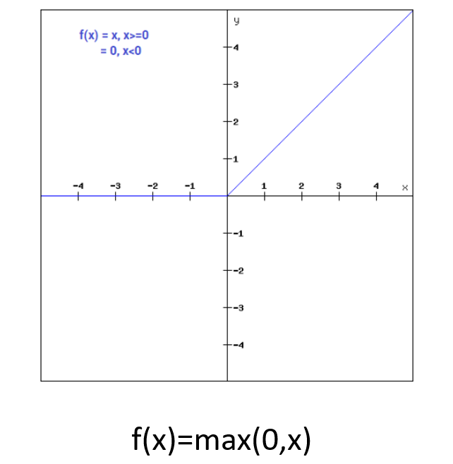

>Source : [analyticsvidhya](https://www.analyticsvidhya.com/blog/2020/01/fundamentals-deep-learning-activation-functions-when-to-use-them)

ReLU helps the Model to have :  
[x] Non linear behaviour & Multi-classes classification capacity
*Imagine that we have a group A of neurons evaluating the input if it belongs to class 1 and a group B of neurons evaluating the input if it belongs to class 2. The ReLu activation function helps to cut the link between group A of neurons to class 2 evaluation and vice-versa. So when group A gives 'NO' answer for an input, its 'NO' answer doesn't affect the evaluation process of group B of neurons*  

[x] Faster convergence, aka. ease the back-propagation in the training phase
*After each new training input, only neurons giving 'YES' answer get updated*  

*ReLU activation in action &#8595;*  
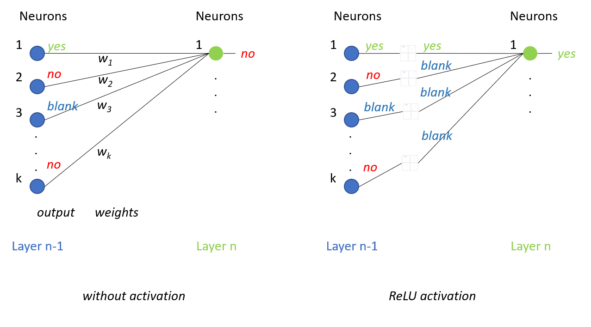

>Source : nguyenrobot

Sometimes, Leaky ReLU is used to do not completely cut the link between groups of neurons because in practice, neurons' groups are not completely independent grouped into A, B, C.. groups for the classifying process.    

#### 4. Human vs deep learning in computer vision  
When human does computer vision, we start by picking some well-known operations, then we define thresholds and logical formulas to get the output.  
*Human does computer vision &#8595;*  
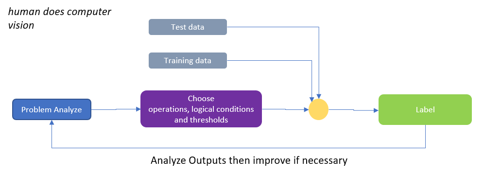

>Source : nguyenrobot

With Deep Learning, human firstly chooses an architecture then all the parameters are randomly initialized in the beginning of the training phase.  
As an example in computer vision, the input is a vector of all pixel called X, the output is a vector of logits corresponding to classes called Z. The vector of labels is Y (1 0 0.. if the current image belongs to class 1).  

*Deep learning does computer vision &#8595;*  
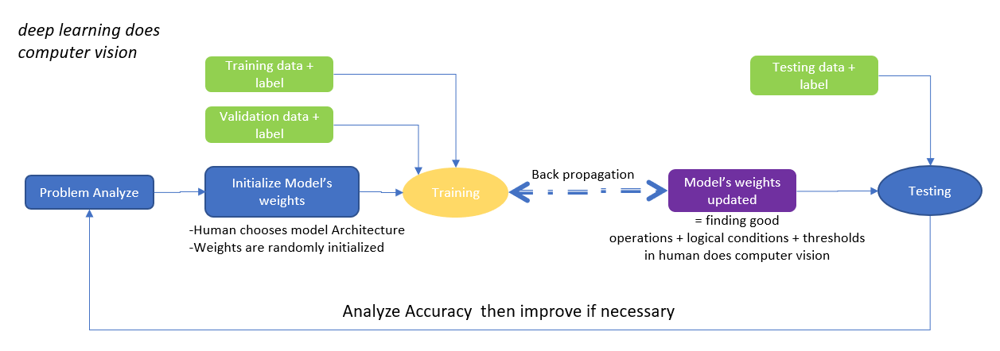

>Source : nguyenrobot

*Gradient descent &#8595;*  
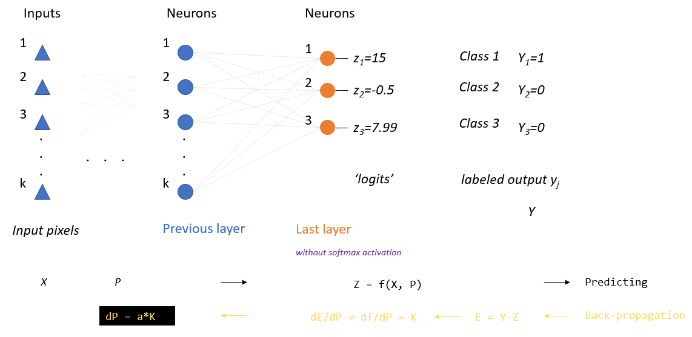

>Source : nguyenrobot

Gradient Descent is the most used method to get Neural Networks updated during the training phase.  
*In predicting phase :  
[x] z = f(X,P)  
[x] P are randomly initialized in the beginning then get gradually updated in training phase when we inject new images.  
f(X,P) is roughly a huge matrix calculation from input vector X and all trainable parameters P of the Neural Network (neurons' weights & convolutional filters' weights)

*In back-propagation phase :  
[x] E = Y -Z : error or Cross Entropy Loss  
[x] dE/dP = df/dP = K : derivative of error
[x] dP = a*K is taken to update our P, a is a numerical `learning rate` could be constant or adaptative value  

## Data Set Summary & Exploration
#### 1. Basic summary of the dataset
Datasets for training, validation and testing are found inside `\traffic-signs-data`, coming from the [German Traffic Sign Dataset](http://benchmark.ini.rub.de/?)  
The size of datasets are :

- [x] Sample size    : (32, 32, 3)  
- [x] Training Set   : 34799 samples  
- [x] Validation Set : 4410 samples  
- [x] Test Set       : 12630 samples  
- [x] N° of classes  : 43  

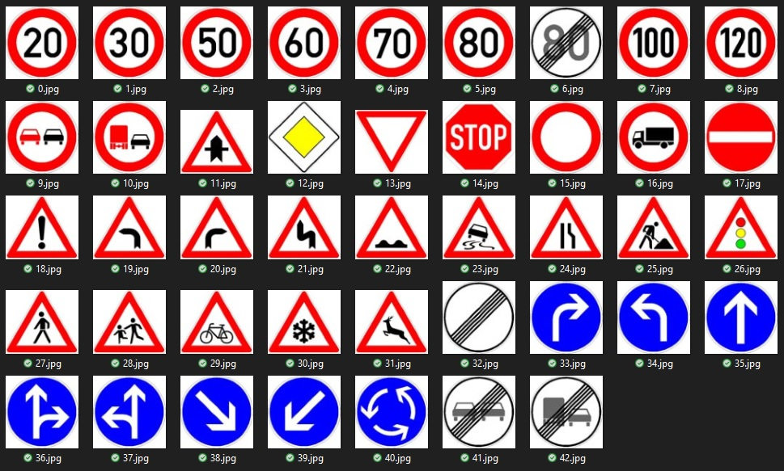

#### 2. Visualization of the dataset

Here is an exploratory visualization of the data set. It is a bar chart showing how the data is distributed.  

>*INI German dataset &#8595;*  
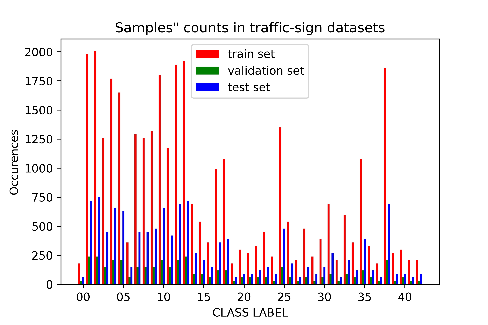  
Source : INI German dataset

It's natural that for traffic signs that could engender confusion - even for a human, their numbers of samples are much higher than others.
>*Confusion matrix, Image Credit : German Traffic Signs Dataset from INI &#8595;*  
  
Source : http://benchmark.ini.rub.de/?section=gtsrb&subsection=dataset

## Design and Test a Model Architecture
#### 1. Image preprocessing
##### Color-Space
Pierre Sermanet and Yann LeCun used YUV color-space with almost of processings on Y-channel (Y stands for brightness, U and V stand for Chrominance). Many other works in computer vision also relay on gray-scale because a human can naturally classify objects in black and white, a frame in gray-scale could save memory and keep easier for normalization phase in data pre-processing.  
I will follow this tradition for my first attempts then will try in HSL color-space in the end. I think that we lost information in grayscale, so I hope that using HSL color-space helps us to have intuitively the perception of Hue, Saturation and Lightness in some cases it could improve the final accuracy and prevent confusions. Of course, we have to sacrifice the performance and memory consumption in the training phase and then speed in the prediction phase.  

##### Normalization
Generally, we normalize data to get them centre around 0 and to have standard deviation near to 1.
- [x] to prevent numerical errors due to many steps of matrix operation. Imagine that we have 255x255x255x255xk operation, it could give a huge numerical error if we just have a small error in k.  
- [x] to help the training phase converges more quickly by forcing inputs to have similar mean and deviation

#### 2. Model architecture

* LeNet  

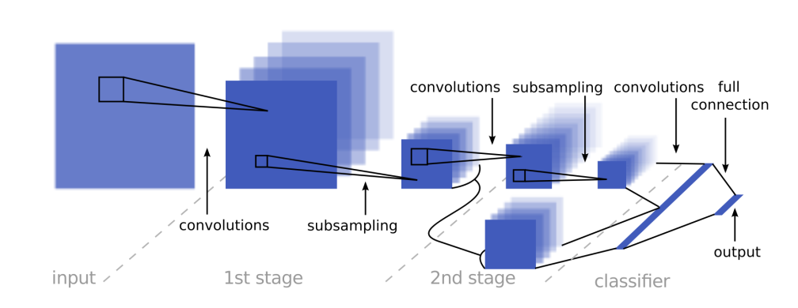

>Source : [Traffic Sign Recognition with Multi-Scale Convolutional Networks](http://yann.lecun.com/exdb/publis/pdf/sermanet-ijcnn-11.pdf) by Pierre Sermanet and Yann LeCun in 1998

The original LeNet is used for hand-writing digits classification which does have just 10 classes. So to work well with our traffic signs having 43 classes, I lightly changed the depth of the original LeNet architecture.  

* GoogLeNet

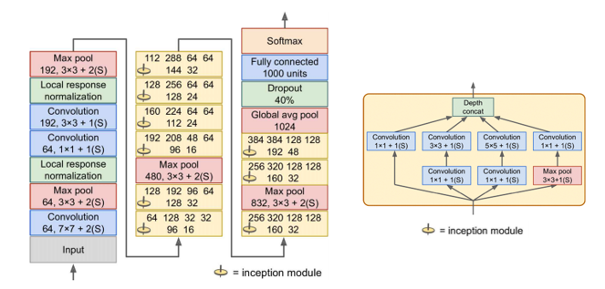

>Source : Aurélien Géron, "Hands-On Machine Learning with Scikit-Learn, Keras, and TensorFlow", page 466-468, Figure 14-13 and 14-14.

* ResNet  

>Source : Aurélien Géron, "Hands-On Machine Learning with Scikit-Learn, Keras, and TensorFlow", page 471, Figure 14-17.

#### 3. Train the model

`Batch size` : I prefer to use batch size at 32. ["Friends don't let friends use mini-batches larger than 32."](https://twitter.com/ylecun/status/989610208497360896?s=20) Yann Lecun tweeted. With Tensorflow backend and OpenCV for image preprocessing, we wouldn't have GPU memory with big batch size. However, on a 2GB memory dedicated GPU card and using Pytorch library, we would have memory problems.  
`Number of epochs` : 30 epochs is sufficient for small-scale datasets. Skip-layer connection as in Residual Network could help the training phase converge quickly.  
`Optimizer` : SGD, Adam, Nadam  
`Learning rate` : 0.001 is prefered

#### 4. Data augmentation
Keras disposes of a data augmentation API that helps us to enrich our training dataset. Usually, we enhance our training dataset with geometric transforms to reply to various inputs.  
Here is an example of augmented input :  
*Data augmentation, example for a 60kmph limit sign &#8595;*  
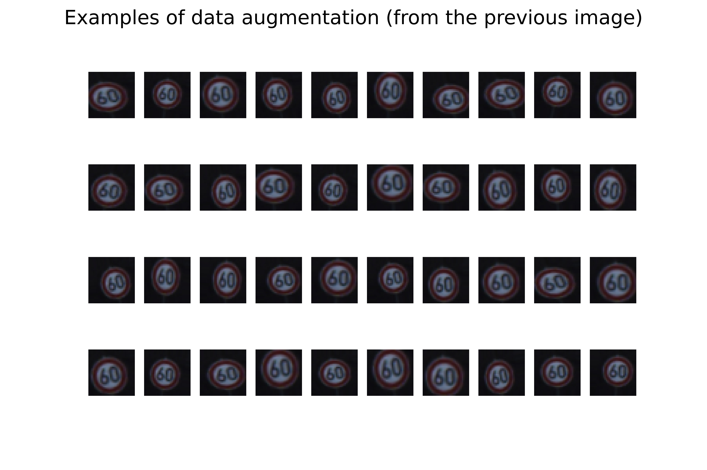

>Source : nguyenrobot

## Test the model on validation dataset & the test dataset
Normally, we can use 1/3 of our labelled dataset for cross-validation.  
-[x] Our validation dataset is pre-prepared with 4410 samples.  
-[x] Our test dataset is pre-prepared with 12630 samples.  

*Prediction accuracyof original architectures &#8595;*  
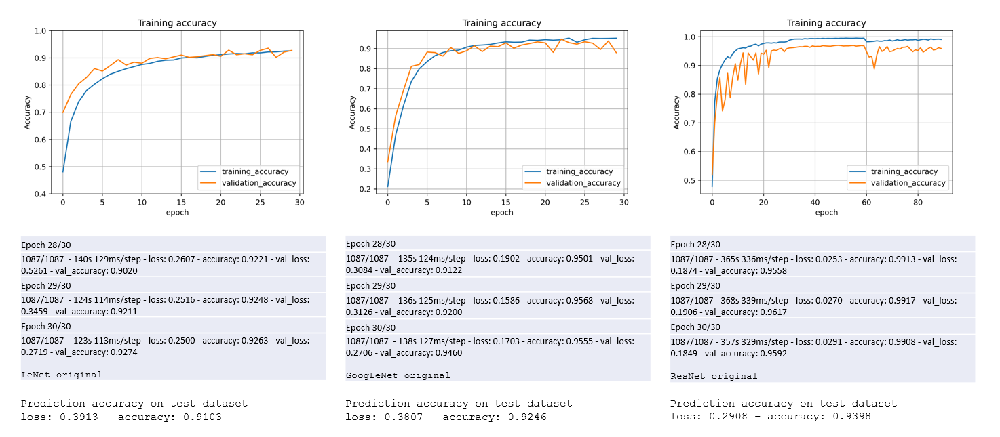

>Source : nguyenrobot

We need to get 93-95% of validation accuracy at least to be considered as a robust classifier. With `LeNet`, `GoogLeNet` and `ResNet` original architectures, we nearly achieve the objective.  
`LeNet` :  originally, LeNet architecture is invented for handwritten-numbers recognition, it's not perfectly adapt for traffic signs classification  

`GoogLeNet` and `ResNet` :  originally, they are used for image classification of 224x224 pixels, it's not perfectly adapt for our traffic signs classification at 32x32 pixels  

Thank confusion matrix, we could identify whether to enhance :  
-[x] training dataset  
-[x] real-time data augmentation  
-[x] preprocessing method  

Here are some extractions of confusion matrices for test dataset of 12630 samples :  
*confusion matrix, LeNet &#8595;*  

*confusion matrix, GoogLeNet &#8595;*  
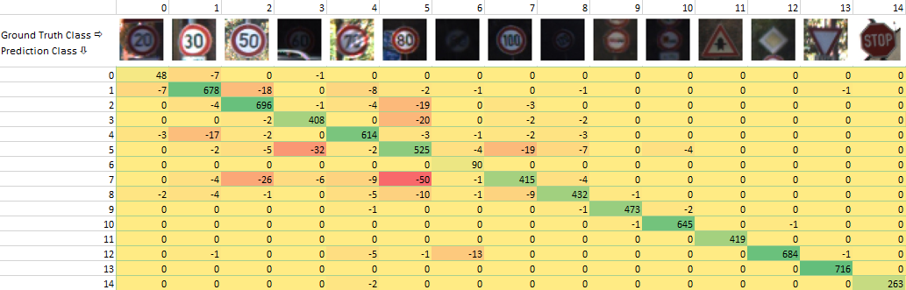

*confusion matrix, ResNet 34 &#8595;*  
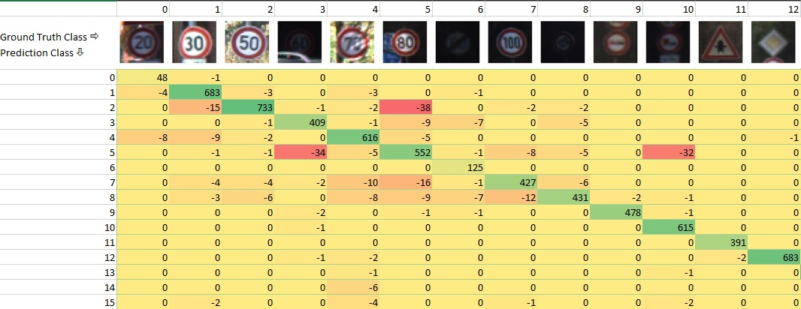

>Source : nguyenrobot

## Test the Model on new images
#### 1. Choose French traffic signs

Here are some French traffic signs that I filmed on roads.  
*French traffic signs filmed on roads &#8595;*  
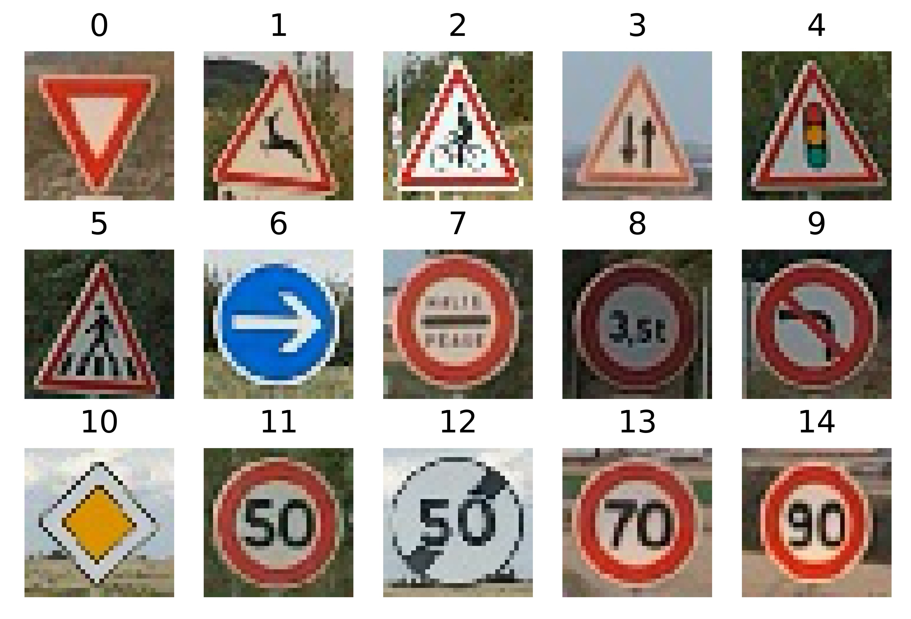

*German traffic signs from INI dataset, in stardard form &#8595;*  

#### 2. Some common french traffic signs are not present in INI German traffic signs dataset or differed
Whatever our input - even if it's not present in the training dataset, by using softmax activation our classifier can not say that 'this is a new traffic sign that it doesn't recognize', it's just trying to find a class that probably most suitable for the input (sum of probability across all classes is 1).  

When a sign doesn't be present in our training dataset, we'll try to find a 'similar' class to label it as :  

image 2 : class 29 differed   
image 3 : 'class 24', double-sens not existed  
image 5 : class 27 differed  
image 6 : 'class 33', not existed  
image 7 : 'class 17', halte-péage not existed  
image 8 : 'class 15', 3.5t limit not existed   
image 9 : 'class 15', turn-left inhibition not existed  
image 12 : 'class 2', ending of 50kmh speed-limit not existed  
image 14 : 'class 2', 90kmh speed-limit not existed  

#### 3. Softmax probabilities for prediction
*in case that we use softmax activation at the last layer  
If we use softmax activation in the last layer, it's very convenient to get directly the probabilities that an input image could belong to each class. However, when the input image does not belong to any class, the prediction is totally wrong ! There will be always a class that the input should be in, for the classifier.  

*Visualization of softmax probabilities &#8595;*  
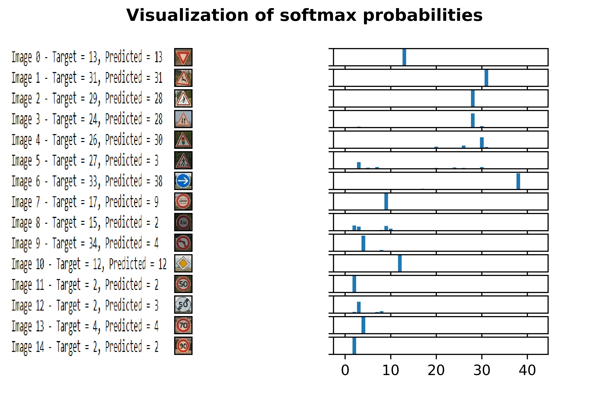

*in case that we don't use softmax activation at the last layer  
If we don't use softmax activation in the last layer, e will get 'logits' at the output for each class. 'logits' are very abstract but then we can add a separated softmax calculation to see the probabilities. Thank to 'logits', if they are all negative we can conclude that the input image does not belong to any class in the training dataset.  

Here is an example of output logits for a totally strange image, the classifier can not recognize it in any class of training dataset, so all of the outputs' logits are negative.  
*Visualization of logits for a strange input image &#8595;*  
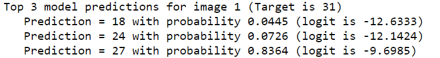

## Enhancements
#### 1. Enhancements in model architecture
*skip-connections ft. convolutional filter of layer's size 
Taking the idea of skip connections in Residual Units of ResNet architecture, I created full-size convolutional filters at each stage of my neural network then inject them to a concatenation layer before the final fully-connected layer.  

*LeNet ft. skip-connections & full convoluional filter &#8595;*  
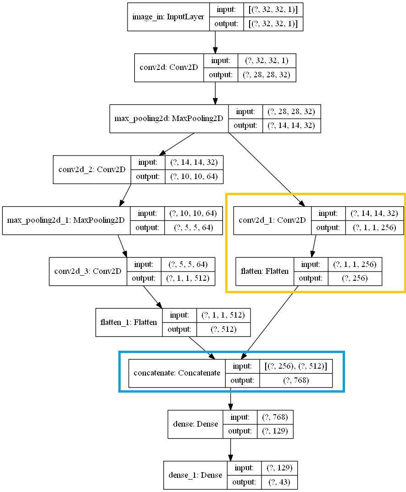

>Source : nguyenrobot

*GoogLeNet ft. skip-connections & full convoluional filter &#8595;*  
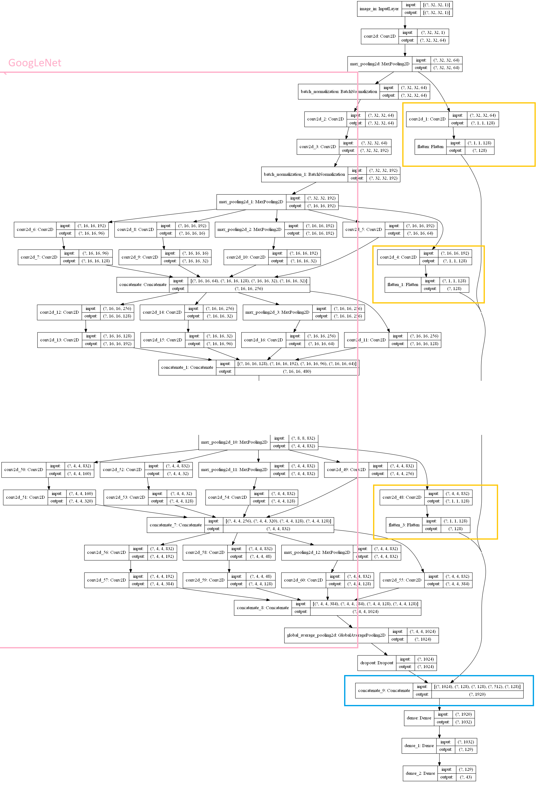

>Source : nguyenrobot

*ResNet ft. skip-connections & full convolutional filter &#8595;*  
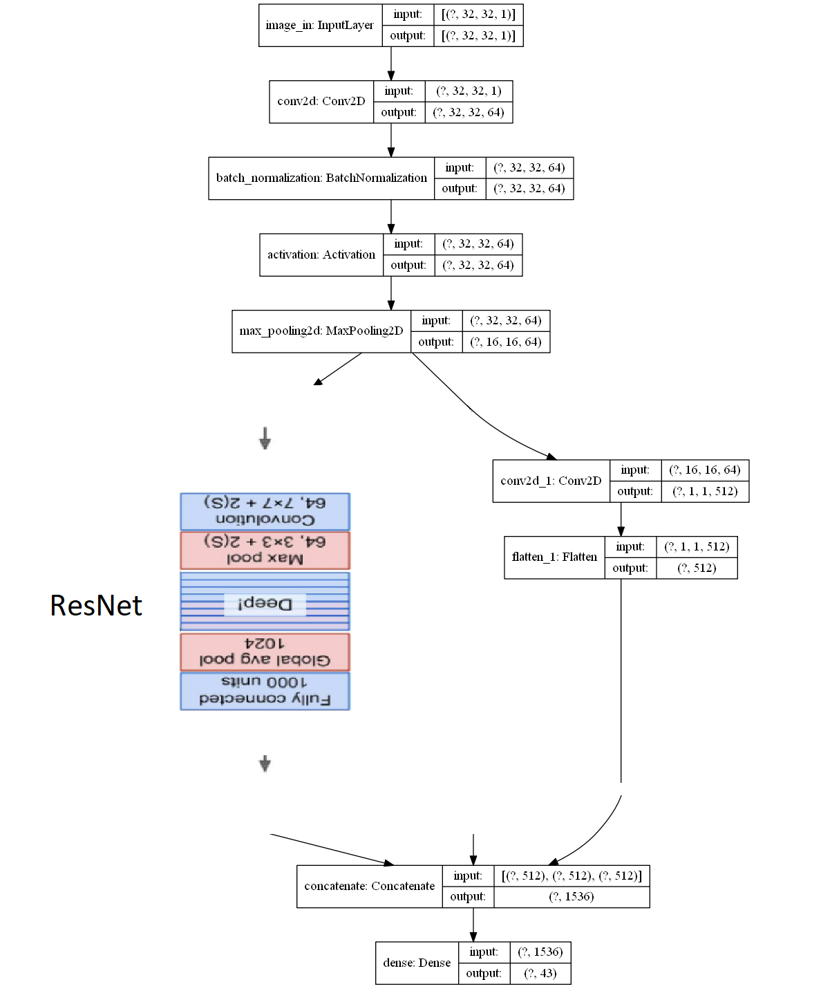

>Source : nguyenrobot

The prediction accuracy is sharply improved with this tweak. At each stage of the neural network, we dispose of a certain level of information. The fact to concatenate all levels of details in the final layer helps us to harmonize global features and local features of an input image.  

*Prediction accuracy of improved architectures &#8595;*  
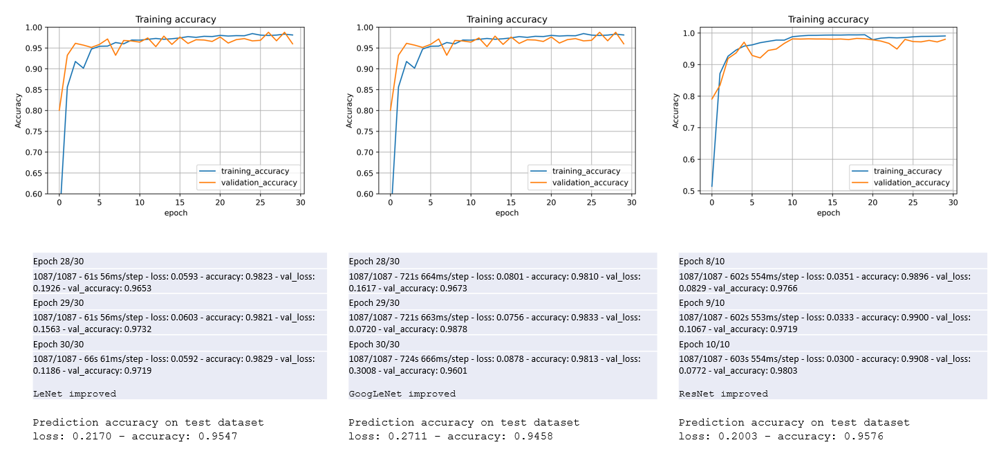

>Source : nguyenrobot

#### 2. Enhancements in preprocesssing
*HSL color-space  
For more details about HLS color-space, please check my previous tutorial on [Medium - lane-detection-for-adas-application](https://nguyenrobot.medium.com/lane-detection-for-adas-application-with-sliding-windows-technics-350d273367cc)  
Hoping that with more information than gray-scale (channel Y from YUV color-space), we will improve that classifier accuracy.  

*RGB to HLS color-space &#8595;*  
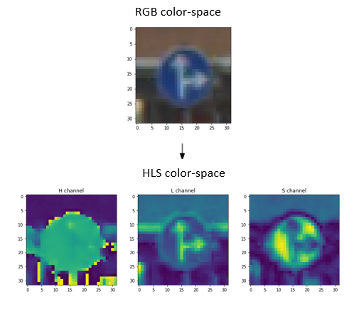

Interestingly, the classifier is more fitted with the training dataset but it's also `over-fitted` for generalized input traffic signs image. So, the prediction on validation and test datasets have slightly fallen.  
*HLS vs Y(UV) in classification accuracy &#8595;*  
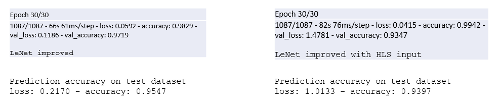

*Convolutional filter at size 1x1  
Trying to remediate HLS overfitting issue, I applied a convolutional layer at size(1,1) just the HLS input. This convolutional layer at size(1,1) works very similarly to gray-scale transform, it takes HLS information of each pixel then combine them to get just one-channel information.  
*Convolutional filter at size 1x1 &#8595;*  
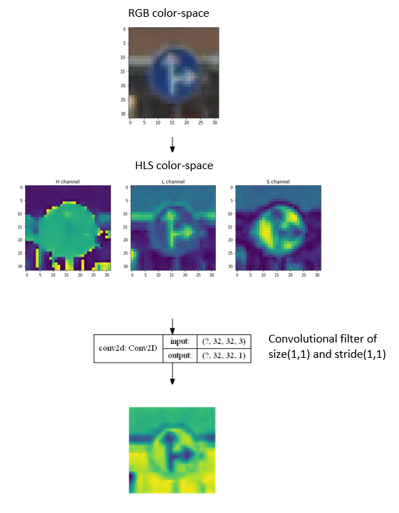

*HLS_ft_Conv_1x1 vs Y(UV) in classification accuracy &#8595;*  
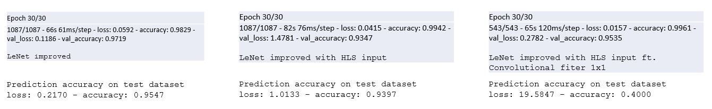

>Source : nguyenrobot

In contrary to my intention, the model is even more over-fitted so the classification accuracy on test dataset dramatically falls from 95,7% to 40% !  

So for classification problems, we understand that why in the original paper of [LeNet architecture](http://yann.lecun.com/exdb/publis/pdf/sermanet-ijcnn-11.pdf), the authors only used Y channel from YUV color-space.  
`More information sometimes is bad for deep-learning !`  

#### 3. Enhancements in the training dataset
Intrigued by the question `what if we use soft activation in the last layer to get directly probabilities but also to keep the classifier classify well new instance images that do not belong to any classes in training dataset`, I tried to add special images to the training dataset.  

*Special signs added to the training dataset &#8595;*  
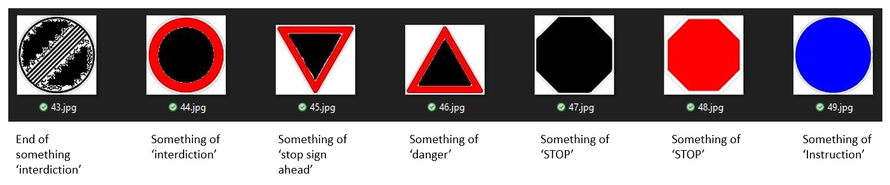

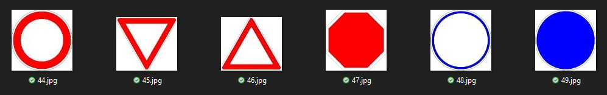

>Source : nguyenrobot

However, these enhancements don't give any better outcome.  

## Visualization of layers
The depth (number of feature-maps) of each layer is one of the most important hyper-parameter for an architecture.  
-[x] A layer not deep enough couldn't extract enough details  
-[x] A layer too deep could get the model overfitted  
-[x] A layer too deep get the training and prediction processes slow and resources-consuming  

In deep learning, there is no perfect model. For each problem, we need to tweak, train and tweak, again and again, to get a good enough model.  

*Visualization of some layers &#8595;*  

>Source : nguyenrobot

A simple visualization could help us to see if a layer extracts enough details or not then we can adjust their depth.  

# Wrapping up
**-[x] Jupyter notebooks listing**  

*Original architectures* :  
`LeNet` traffic_sign_classifier_LeNet.ipynb without softmax activation in last layer, accuracy on test dataset of 91%  

`GoogLeNet` traffic_sign_classifier_GoogLeNet.ipynb with softmax activation in last layer, accuracy on test dataset of 92,46%  

`ResNet` traffic_sign_classifier_ResNet.ipynb with softmax activation in last layer, accuracy on test dataset of 93,98%  

*Improved architectures* :  
`LeNet improved` traffic_sign_classifier_LeNet_improved.ipynb without softmax activation in last layer, accuracy on test dataset of 95,47%  

`GoogLeNet improved` traffic_sign_classifier_GoogLeNet_improved.ipynb with softmax activation in last layer, accuracy on test dataset of 94,58%  

`ResNet improved` traffic_sign_classifier_ResNet_improved.ipynb with softmax activation in last layer, accuracy on test dataset of 95,76%  

*Tries on HLS color-space and dataset enhancements * :  
traffic_sign_classifier_LeNet_enhanced_trainingdataset.ipynb  
traffic_sign_classifier_LeNet_enhanced_trainingdataset_HLS.ipynb  
traffic_sign_classifier_LeNet_enhanced_trainingdataset_white.ipynb  
traffic_sign_classifier_LeNet_HSL_ft_Conv_f1x1.ipynb  
traffic_sign_classifier_ResNet_HSL_ft_Conv_f1x1.ipynb  

**-[x] Object detection tutorial**  
I will work on another tutorial for object detection and localization, please stay tuned and follow my linkedin or my medium or my github for updates.  

Linkedin __| linkedin.com/in/phuc-thien-nguyen  

Medium __| nguyenrobot.medium.com  

Github ____| github.com/nguyenrobot